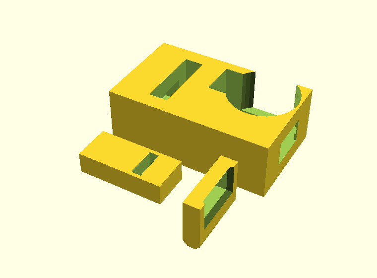

# Tresorbox

Eine gedruckte Kiste, die ein Servo verriegelt und die Tresor-App aufsperrt.
Drei gedruckte Teile, drei gekaufte, rund 14 Euro.




*Oben die Kiste, darunter das Prüfstück: Blockausschnitt mit Bohrung und
Schlitz, dazu kurzer Riegel und kurze Zunge. 20 Minuten Druck.*

## Wie sie hält

Am Deckel hängt eine Zunge nach unten – ein flaches Blatt **quer** zur
Fahrtrichtung des Riegels. Sie fällt in einen Schlitz im Körper, und quer durch
diesen Schlitz läuft die Riegelbohrung. Fährt der Riegel aus, steckt er durch
das Loch in der Zunge.

Zieht jemand am Deckel, drückt die Zunge gegen den Riegel und der gegen die
Wand seiner Bohrung. **Die Kraft läuft in den Körper, nicht ins Getriebe.** Das
Servo schiebt den Riegel nur längs, über einen M3-Stift, der in einem
Querschlitz läuft – eine Kurbelschleife. Die Bauart verträgt Toleranzen, und
genau das braucht man bei gedruckten Teilen.

Der Hub ergibt sich aus der Kurbel: 9 mm Stiftradius, ±45° Schwenk, macht
12,7 mm. Verriegelt steht die Spitze 3,5 mm hinter der Zunge, offen 3,2 mm
davor.

## Einkaufszettel

Die Maße stammen aus `tresorbox.scad` – die Tasche ist auf genau diese Teile
konstruiert.

| # | Teil | Worauf achten | ca. |
|---|---|---|---|
| 1 | **ESP32-C3 Supermini** | Platine ≤ 24 × 19 mm. Ein normales DevKit-Board (52 × 28) passt nicht ins Bett | 4 € |
| 2 | **Servo SG90** (9 g) | Rumpf 23,2 × 12,4 × 23 mm, Flanschabstand 32,5 mm. **MG90S** (Metallgetriebe) ist maßgleich und hält länger | 3 € |
| 3 | **Servohorn, einarmig** | liegt dem Servo bei. Braucht ein Loch **9 mm von der Mitte** – die äußerste Bohrung, notfalls auf 3 mm aufbohren | – |
| 4 | **Elko 1000 µF, ≥ 6,3 V** | radial, Raster 5 mm | 0,50 € |
| 5 | **M3-Schraube, 12 mm** | Zylinderkopf, plus **eine M3-Mutter** zum Kontern | 0,20 € |
| 6 | **Dupont-Litzen, 3 ×** | weiblich/weiblich, 10–20 cm | 1 € |
| 7 | **USB-Kabel + 5-V-Netzteil, ≥ 1 A** | passend zum Board (C oder Micro). Eine Powerbank geht auch | 5 € |
| 8 | **Kabelbinder, klein** | Zugentlastung innen an der Wand | – |
| 9 | **PETG-Filament, ca. 175 g** | **kein PLA** – das kriecht unter Dauerlast | 4 € |

**Zusammen rund 18 €**, ohne Filament 14 €.

Schrauben fürs Servo (2 ×, selbstschneidend) liegen dem Servo bei.

### Nur fürs Prüfstück

**Nichts davon.** Die drei gedruckten Teile reichen für den mechanischen Test
(ca. 22 g Filament). Wenn Servo und M3-Schraube schon da sind, nimm sie mit –
die Tasche ist vollständig enthalten und SG90-Klone streuen um bis zu drei
Zehntel. ESP32, Kondensator und Kabel brauchst du erst mit der Firmware.

### Warum diese Teile

**Der ESP32-C3 Supermini, nicht irgendein ESP32.** Das Platinenbett ist
24 × 19 mm; die verbreiteten DevKit-Boards sind doppelt so groß und passen
nicht. BLE, genug Strom am 5-V-Pin und Arduino-IDE-Unterstützung hat er.

**Der Kondensator ist nicht optional.** Ohne ihn bricht die Spannung beim
Anlaufen des Servos ein und der ESP32 startet neu – jedes Mal, wenn das
Schloss aufgehen soll. Das ist der Fehler, den man zwei Abende lang sucht.

**M3 mit 12 mm.** Sie steckt von oben durchs Horn und greift als Mitnehmer in
den Querschlitz des Riegels. Die Länge ist unkritisch: 8 bis 12 mm dürfen
unten herausstehen, darunter liegt ein Freigang.

**Netzteil mit mindestens 1 A.** Ein SG90 zieht beim Anlaufen kurz ein halbes
Ampere. Am Handy-Ladegerät mit 500 mA startet der ESP32 neu.

## Drucken

```
openscad -D 'teil="koerper"' -o koerper.stl tresorbox.scad
openscad -D 'teil="deckel"'  -o deckel.stl  tresorbox.scad
openscad -D 'teil="riegel"'  -o riegel.stl  tresorbox.scad
```

| | Lage | Stützen |
|---|---|---|
| Körper | wie konstruiert, Öffnung nach oben | nein |
| Deckel | flach, Zunge nach oben | nein |
| Riegel | liegend | nein |

0,2 mm Schichten, **4 Perimeter**, 30 % Füllung. Bauraum: 126 × 86 × 48 mm.
Keines der Teile braucht Stützmaterial – Servotasche und Zungenschlitz sind
nach oben offen.

### Erst das Prüfstück

```
openscad -D 'teil="pruefstueck"' -o pruefstueck.stl tresorbox.scad
```

60 × 57 × 21 mm, rund 25 Minuten. Darin steckt der Ausschnitt des Blocks mit
Riegelbohrung, Zungenschlitz **und der vollständigen Servotasche**, dazu ein
kurzer Riegel und eine kurze Zunge – erzeugt aus **denselben Modulen** wie die
Kiste. Baute man es nach, prüfte es seine eigene Kopie.

**Was du dafür brauchst:** für den rein mechanischen Test gar nichts außer den
drei gedruckten Teilen. Riegel von Hand durch die Bohrung schieben, Zunge in
den Schlitz fallen lassen – das beantwortet schon die meisten Fragen.

Wenn du **Servo und M3-Schraube** schon da hast, setz sie gleich mit ein: Die
Tasche ist vollständig enthalten, und Klone streuen um bis zu drei Zehntel.
Das merkt man lieber jetzt als an der fertigen Kiste. **ESP32, Kondensator und
Kabel brauchst du für den Test nicht** – die kommen erst mit der Firmware ins
Spiel, und die gibt es noch nicht.

Damit beantwortest du in 20 Minuten die einzige Frage, die sich vorher nicht
rechnen lässt: ob *dein* Drucker diese Passungen trifft. Der Riegel soll unter
seinem eigenen Gewicht durch die Bohrung rutschen, die Zunge ohne Kraft in den
Schlitz fallen.

| Befund | Stellschraube |
|---|---|
| Riegel klemmt | `spiel_riegel` von 0,35 auf 0,45 |
| Riegel klappert hörbar | `spiel_riegel` auf 0,25 |
| Riegel hakt in der Mitte | `spiel_decke` auf 1,0 – die Brücke sackt durch |
| Zunge geht schwer in den Schlitz | `spiel_zunge` auf 0,65 |
| Riegel trifft das Loch nicht | `spiel_loch_y` auf 1,3 |

Erst wenn das sitzt, die große Kiste drucken.

## Zusammenbau

1. **Horn vorbereiten.** Einarmiges Servohorn nehmen, das äußerste Loch (9 mm
   von der Mitte) auf 3 mm aufbohren. M3-Schraube von oben durchstecken,
   sodass sie nach unten zeigt, mit der Mutter oben kontern. 8 bis 12 mm
   dürfen unten herausstehen – die Länge ist unkritisch, unter der Bohrung
   liegt ein Freigang.
2. **Riegel einschieben.** Von innen links in die Bohrung, bis der Querschlitz
   unter der Servoachse steht.
3. **Servo einsetzen.** Von oben in die Tasche, der Stift muss in den
   Querschlitz fallen. Flansche festschrauben.
4. **Von Hand prüfen.** Horn hin und her drehen – der Riegel muss über die
   vollen 12,7 mm laufen, ohne zu haken. **Erst danach Strom anschließen.**
   Ein Servo, das gegen einen klemmenden Riegel drückt, zieht 700 mA, wird
   heiß und stirbt.
5. **Mittelstellung finden.** Servo auf 90° fahren, *dann* das Horn
   aufstecken – der Riegel soll dabei auf halbem Weg stehen. Steckst du es
   schief auf, fehlt an einem Ende der Hub.
6. **Verdrahten** (siehe unten), Platine ins Bett legen. Das Kabel von außen
   durch das 12-mm-Loch schieben – der Stecker passt hindurch – und innen mit
   einem Kabelbinder gegen Zug sichern.

## Verdrahtung

| Servo | ESP32-C3 |
|---|---|
| braun (GND) | GND |
| rot (+) | 5V |
| orange (Signal) | GPIO 4 |

Der Kondensator kommt **zwischen 5V und GND, möglichst nah am Servo** –
langes Bein an 5V.

Das USB-Kabel versorgt die Platine, das Servo hängt an deren 5V-Pin. Achte auf
ein Netzteil mit mindestens 1 A; ein SG90 zieht beim Anlaufen kurz ein halbes.

## Toleranzen

Die Passungen sind **nach Aufgabe getrennt**, nicht über einen Wert geregelt:

| Parameter | | wofür |
|---|---|---|
| `spiel_riegel` | 0,35 | Gleitsitz des Riegels in seiner Bohrung |
| `spiel_decke` | 0,8 | zusätzlich oben – die Bohrungsdecke ist eine Brücke |
| `spiel_zunge` | 0,5 | Zunge in ihren Schlitz; **dieses Merkmal führt** |
| `spiel_loch_y` | 1,0 | Riegel durch das Loch der Zunge, quer |
| `spiel_loch_z` | 0,5 | … und hoch |
| `spiel_rand` | 0,8 | Deckelrand – bewusst lose |
| `spiel_servo` | 0,5 | Servotasche; gehalten wird es von den Schrauben |

Drei Überlegungen stecken dahinter:

**Nur ein Merkmal darf führen.** Deckelrand und Zunge richten beide den Deckel
aus. Wären beide stramm, arbeiteten sie gegeneinander, und der Deckel klemmte,
sobald der Druck ein Zehntel daneben liegt – erst recht bei PETG, das über
120 mm um ein halbes Millimeter schrumpft. Deshalb führt die Zunge (nur ihre
Lage entscheidet, ob der Riegel trifft) und der Rand ist absichtlich weit.

**Die Bohrung ist unten knapp und oben weit.** Der Riegel liegt durch die
Schwerkraft ohnehin auf dem Boden; nur dort braucht es einen Gleitsitz. Die
Decke überbrückt 14,7 mm und sackt beim Drucken um zwei bis drei Zehntel
durch – mit gleichem Spiel klemmte der Riegel genau in der Mitte seines Weges.

**Quer stapeln sich zwei Fehler, hoch keiner.** Der Riegel darf in seiner
Bohrung um 0,35 mm wandern, die Zunge in ihrem Schlitz um 0,5 – zusammen
0,85 mm. Deshalb ist das Loch **quer** 1,0 mm weit. Hoch stapelt sich nichts:
Der Riegel liegt auf dem Bohrungsboden, der Deckel sitzt auf den Wänden.
Beides ist bestimmt, und viel Spiel hieße dort nur, dass der Deckel wackelt.

Dazu drei Fasen, die Maßabweichungen abfangen statt sie zu verbieten: ein
Trichter am Schlitzmund, eine Anfasung an der Zungenspitze und eine rundum
laufende Fase an der Riegelspitze. Und ein Freigang unter der Bohrung für den
Mitnehmerstift – ohne ihn müsste die M3-Schraube auf ein Zehntel genau
abgelängt werden.

## Maße nachrechnen

Alle Parameter stehen oben in `tresorbox.scad` – Innenmaße, Wandstärke, Spiel.
Nach jeder Änderung:

```
python3 pruefung.py
```

Das rechnet die kritischen Beziehungen nach: ob der Riegel durch die Zunge
geht **und** sie wieder freigibt, ob Stift und Querschlitz sich in beiden
Endlagen treffen, ob das Servo hineinpasst, ohne die Wand zu durchbrechen.

Die Prüfung ist nicht Zierde. Beim Entwurf hat sie drei Fehler gefunden, die
auf dem Bildschirm unsichtbar waren: eine Servotasche, die durch die
Vorderwand brach; einen Riegel, der offen nur 0,3 mm vor der Zunge stand und
den Deckel nicht freigegeben hätte; und eine Zunge, unter deren Riegelloch nur
2,6 mm Material stehen blieben.

## Was hineinpasst

Der Verschlussblock steht vorn über die volle Breite und frisst die ersten
38 mm der Tiefe – **48 % bei der kleinen Kiste**. Übrig bleibt:

| | |
|---|---|
| Innenraum brutto | 120 × 80 × 45 mm = 432 cm³ |
| davon Block | 120 × 38 × 39 mm |
| **nutzbar** | **120 × 42 × 45 mm ≈ 220 cm³** |

Abzüglich der Platinenecke hinten rechts (24 × 19 mm Grundfläche). Das ist
eine Grundfläche wie eine Postkarte, 45 mm hoch: Schlüssel, ein gefalteter
Zettel, ein USB-Stick, eine Uhr, eine Tafel Schokolade. **Kein Handy** – das
ist 160 × 75 mm und scheitert an der Tiefe.

`pruefung.py` rechnet den Nutzraum bei jeder Parameteränderung mit aus.

### Für ein Handy

```
innen_x = 175;  innen_y = 125;  innen_z = 25;
```

Damit bleiben 175 × 87 mm frei. In der ersten Fassung stand hier
`innen_y = 85` – nach Abzug des Blocks wären das 47 mm freie Tiefe gewesen,
und ein Handy ist 75 breit. Es hätte nicht hineingepasst.

Das wird ein langer Druck (Grundfläche 181 × 131 mm). Fang mit der kleinen
Kiste an.

### Mehr Platz herausholen

`block_y` folgt aus der Zungenbreite und dem Servorumpf. Mit `zunge_b = 22`
und `zunge_y = 18` ginge `block_y = 32` – sechs Millimeter mehr Nutztiefe.
Dann bleiben aber nur noch 3 mm Material neben dem Riegelloch. Lauf danach
unbedingt `pruefung.py`.

## Was das ist und was nicht

* **Eine gedruckte Kiste ist kein Safe.** Wer Werkzeug und Motivation hat,
  öffnet sie in einer Minute. Sie hält den eigenen Impuls auf, nicht einen
  Einbrecher – dieselbe Art Hürde wie die NFC-Stationen, nur mit mehr Gewicht.
* **Die Elektronik gehört nach innen.** Nur Kabel und Powerbank sind außen. Wer
  an den ESP32 kommt, kann seinen Flash auslesen – aber dafür müsste er die
  Kiste schon offen haben.
* **Der Strom kommt von außen.** Damit ist ein leerer Akku kein Aussperren,
  sondern ein Steckerwechsel. Das ist der Grund gegen eine Batterie im Inneren.
* **Sperr nichts Dringendes ein.** Keine Medikamente, keine Ausweise, keine
  Autoschlüssel.
* **Die ersten fünfzig Zyklen mit leerer Kiste.** Erst wenn der Riegel
  fünfzigmal sauber gefahren ist, kommt etwas hinein, das dir etwas bedeutet.
  Ein PETG-Riegel, der sich einläuft, wird leichtgängiger – einer, der sich
  verzieht, klemmt irgendwann verriegelt.
* **Die Firmware soll das Servo nach der Fahrt abschalten** (`detach`). Ein
  dauerhaft angesteuertes Servo brummt, zittert und verbraucht Strom, obwohl
  die Last längst in der Bohrungswand hängt.

## Noch nicht gebaut

Die Firmware und die Web-Bluetooth-Seite fehlen. Geplant ist eine
Challenge-Response über BLE: Das Schloss würfelt eine Nonce, die App antwortet
mit `HMAC-SHA256(geheimnis, nonce)`, das Schloss prüft und öffnet zwei
Sekunden. Kein Pairing, nicht wiederholbar.

Das Schlossgeheimnis wird dabei **ein Fragment im Tresor**: Die App besitzt es
erst, wenn Bann und Prüfungen durch sind – vorher kann sie den Handschlag gar
nicht rechnen. Damit ist die Kiste so hart wie die Kryptografie und nicht so
weich wie eine Oberflächenregel.

**Nichts davon ist auf Hardware getestet**, es existiert bisher nur als
Konstruktion. Der erste Druck steht noch aus.
