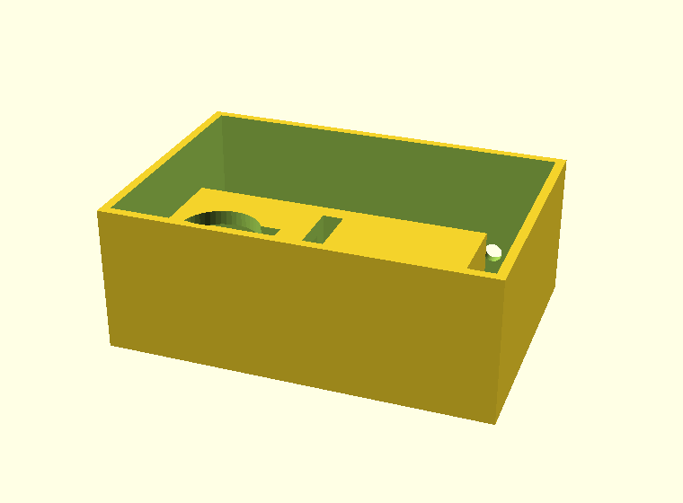

# Tresorbox

Eine gedruckte Kiste, die ein Servo verriegelt und die Tresor-App aufsperrt.
Drei gedruckte Teile, drei gekaufte, rund 14 Euro.



## Wie sie hält

Am Deckel hängt eine Zunge nach unten – ein flaches Blatt **quer** zur
Fahrtrichtung des Riegels. Sie fällt in einen Schlitz im Körper, und quer durch
diesen Schlitz läuft die Riegelbohrung. Fährt der Riegel aus, steckt er durch
das Loch in der Zunge.

Zieht jemand am Deckel, drückt die Zunge gegen den Riegel und der gegen die
Wand seiner Bohrung. **Die Kraft läuft in den Körper, nicht ins Getriebe.** Das
Servo schiebt den Riegel nur längs, über einen M3-Stift, der in einem
Querschlitz läuft – eine Kurbelschleife. Die Bauart verträgt Toleranzen, und
genau das braucht man bei gedruckten Teilen.

Der Hub ergibt sich aus der Kurbel: 9 mm Stiftradius, ±45° Schwenk, macht
12,7 mm. Verriegelt steht die Spitze 3,5 mm hinter der Zunge, offen 3,2 mm
davor.

## Einkaufszettel

| Teil | Suchbegriff | ca. |
|---|---|---|
| Mikrocontroller | **ESP32-C3 Supermini** | 4 € |
| Servo | **SG90** (Kunststoffgetriebe) oder **MG90S** (Metall, hält länger) | 3 € |
| Kondensator | Elko **1000 µF, ≥ 6,3 V** | 0,50 € |
| Mitnehmerstift | M3-Schraube, 12 mm, mit Mutter | 0,20 € |
| Kabel | Dupont-Litzen, weiblich, 3 Stück | 1 € |
| Strom | USB-Kabel + Netzteil **oder Powerbank** | 5 € |
| Filament | **PETG**, ca. 130 g | 3 € |

Schrauben fürs Servo liegen dem Servo bei.

**Nimm PETG, nicht PLA.** PLA kriecht unter Dauerlast und wird im warmen Zimmer
weich – ein Riegel, der wochenlang unter Spannung steht, verformt sich.

**Der Kondensator ist nicht optional.** Ohne ihn bricht die Spannung beim
Anlaufen des Servos ein und der ESP32 startet neu – jedes Mal, wenn das Schloss
aufgehen soll. Das ist der Fehler, den man zwei Abende lang sucht.

## Drucken

```
openscad -D 'teil="koerper"' -o koerper.stl tresorbox.scad
openscad -D 'teil="deckel"'  -o deckel.stl  tresorbox.scad
openscad -D 'teil="riegel"'  -o riegel.stl  tresorbox.scad
```

| | Lage | Stützen |
|---|---|---|
| Körper | wie konstruiert, Öffnung nach oben | nein |
| Deckel | flach, Zunge nach oben | nein |
| Riegel | liegend | nein |

0,2 mm Schichten, **4 Perimeter**, 30 % Füllung. Bauraum: 126 × 86 × 48 mm.

Die Riegelbohrung überbrückt 14 mm. Das schafft jeder Drucker, die Decke wird
nur etwas rau. Klemmt der Riegel danach: `spiel` in der SCAD-Datei von 0,35 auf
0,45 setzen und neu drucken. Wackelt er: auf 0,25.

## Zusammenbau

1. **Horn vorbereiten.** Einarmiges Servohorn nehmen, das äußerste Loch auf
   3 mm aufbohren. M3-Schraube von oben durchstecken, sodass sie nach unten
   zeigt, mit der Mutter oben kontern. Etwa 6 mm sollen unten herausstehen.
2. **Riegel einschieben.** Von innen links in die Bohrung, bis der Querschlitz
   unter der Servoachse steht.
3. **Servo einsetzen.** Von oben in die Tasche, der Stift muss in den
   Querschlitz fallen. Flansche festschrauben.
4. **Von Hand prüfen.** Horn hin und her drehen – der Riegel muss über die
   vollen 12,7 mm laufen, ohne zu haken. Erst danach Strom anschließen.
5. **Verdrahten** (siehe unten), Platine ins Bett legen, Kabel durch das Loch
   hinten, mit einem Kabelbinder gegen Zug sichern.

## Verdrahtung

| Servo | ESP32-C3 |
|---|---|
| braun (GND) | GND |
| rot (+) | 5V |
| orange (Signal) | GPIO 4 |

Der Kondensator kommt **zwischen 5V und GND, möglichst nah am Servo** –
langes Bein an 5V.

Das USB-Kabel versorgt die Platine, das Servo hängt an deren 5V-Pin. Achte auf
ein Netzteil mit mindestens 1 A; ein SG90 zieht beim Anlaufen kurz ein halbes.

## Maße nachrechnen

Alle Parameter stehen oben in `tresorbox.scad` – Innenmaße, Wandstärke, Spiel.
Nach jeder Änderung:

```
python3 pruefung.py
```

Das rechnet die kritischen Beziehungen nach: ob der Riegel durch die Zunge
geht **und** sie wieder freigibt, ob Stift und Querschlitz sich in beiden
Endlagen treffen, ob das Servo hineinpasst, ohne die Wand zu durchbrechen.

Die Prüfung ist nicht Zierde. Beim Entwurf hat sie drei Fehler gefunden, die
auf dem Bildschirm unsichtbar waren: eine Servotasche, die durch die
Vorderwand brach; einen Riegel, der offen nur 0,3 mm vor der Zunge stand und
den Deckel nicht freigegeben hätte; und eine Zunge, unter deren Riegelloch nur
2,6 mm Material stehen blieben.

## Für ein Handy

```
innen_x = 165;  innen_y = 85;  innen_z = 30;
```

Danach `pruefung.py` laufen lassen. Das wird ein langer Druck – fang mit der
kleinen Kiste an.

## Was das ist und was nicht

* **Eine gedruckte Kiste ist kein Safe.** Wer Werkzeug und Motivation hat,
  öffnet sie in einer Minute. Sie hält den eigenen Impuls auf, nicht einen
  Einbrecher – dieselbe Art Hürde wie die NFC-Stationen, nur mit mehr Gewicht.
* **Die Elektronik gehört nach innen.** Nur Kabel und Powerbank sind außen. Wer
  an den ESP32 kommt, kann seinen Flash auslesen – aber dafür müsste er die
  Kiste schon offen haben.
* **Der Strom kommt von außen.** Damit ist ein leerer Akku kein Aussperren,
  sondern ein Steckerwechsel. Das ist der Grund gegen eine Batterie im Inneren.
* **Sperr nichts Dringendes ein.** Keine Medikamente, keine Ausweise, keine
  Autoschlüssel.

## Noch nicht gebaut

Die Firmware und die Web-Bluetooth-Seite fehlen. Geplant ist eine
Challenge-Response über BLE: Das Schloss würfelt eine Nonce, die App antwortet
mit `HMAC-SHA256(geheimnis, nonce)`, das Schloss prüft und öffnet zwei
Sekunden. Kein Pairing, nicht wiederholbar.

Das Schlossgeheimnis wird dabei **ein Fragment im Tresor**: Die App besitzt es
erst, wenn Bann und Prüfungen durch sind – vorher kann sie den Handschlag gar
nicht rechnen. Damit ist die Kiste so hart wie die Kryptografie und nicht so
weich wie eine Oberflächenregel.

**Nichts davon ist auf Hardware getestet**, es existiert bisher nur als
Konstruktion. Der erste Druck steht noch aus.
